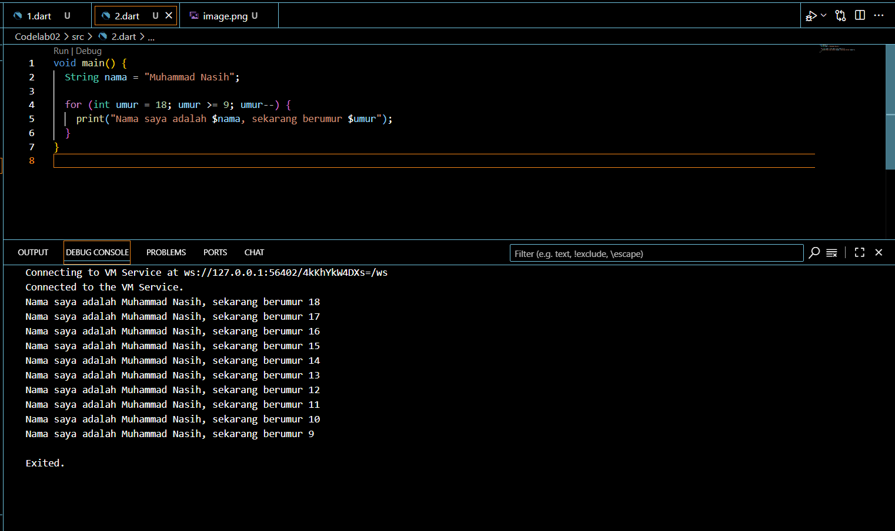
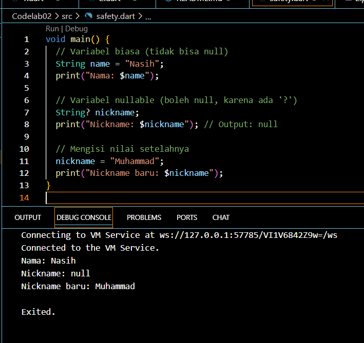
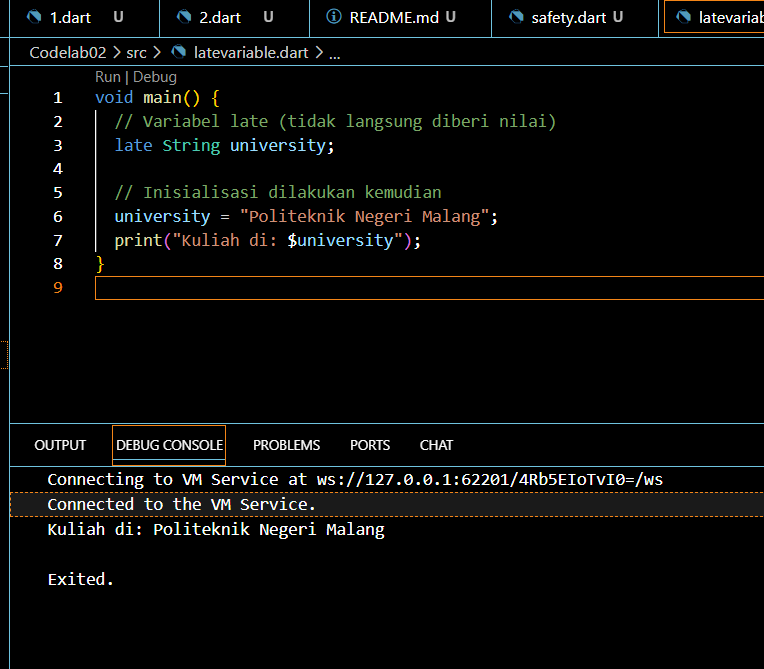

Nama : Muhammad Nasih
Kelas : TI 3H
NIM : 2341720009

Soal 1
Modifikasilah kode pada baris 3 di VS Code atau Editor Code favorit Anda berikut ini agar mendapatkan keluaran (output) sesuai yang diminta!

Soal 2
Mengapa sangat penting untuk memahami bahasa pemrograman Dart sebelum kita menggunakan framework Flutter ? Jelaskan!

Memahami Dart sebelum belajar Flutter sangat penting karena Flutter sepenuhnya dibangun di atas Dart. Dengan dasar Dart yang kuat, proses belajar Flutter akan lebih cepat, coding lebih efisien, dan aplikasi yang dibuat lebih optimal.

Soal 3
Rangkumlah materi dari codelab ini menjadi poin-poin penting yang dapat Anda gunakan untuk membantu proses pengembangan aplikasi mobile menggunakan framework Flutter.

Flutter adalah framework UI berbasis bahasa Dart yang memungkinkan pengembangan aplikasi mobile, web, dan desktop dengan satu basis kode. Konsep utamanya adalah widget, baik stateless maupun stateful, yang digunakan untuk membangun tampilan dan interaksi. Proyek Flutter memiliki struktur dengan main.dart sebagai entry point dan pubspec.yaml untuk mengatur dependency serta asset. Flutter mendukung hot reload untuk mempercepat pengembangan, menyediakan widget layout seperti Row, Column, dan Container, serta mendukung navigasi dengan Navigator. Asset seperti gambar dan font dapat ditambahkan melalui konfigurasi, sementara ribuan package dari pub.dev bisa dimanfaatkan untuk menambah fitur. Best practice yang disarankan adalah memecah kode menjadi widget kecil, menggunakan const pada widget statis, dan menerapkan clean code agar aplikasi lebih efisien dan terstruktur.

Soal 4
Buatlah penjelasan dan contoh eksekusi kode tentang perbedaan Null Safety dan Late variabel !

A.  Null Safety

B. Late variabel

Null Safety → mengontrol apakah variabel bisa bernilai null atau tidak. (String vs String?).

Late Variable → menunda inisialisasi variabel, tetapi menjamin bahwa variabel akan diisi sebelum digunakan.