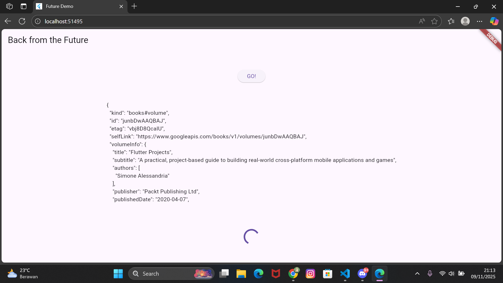
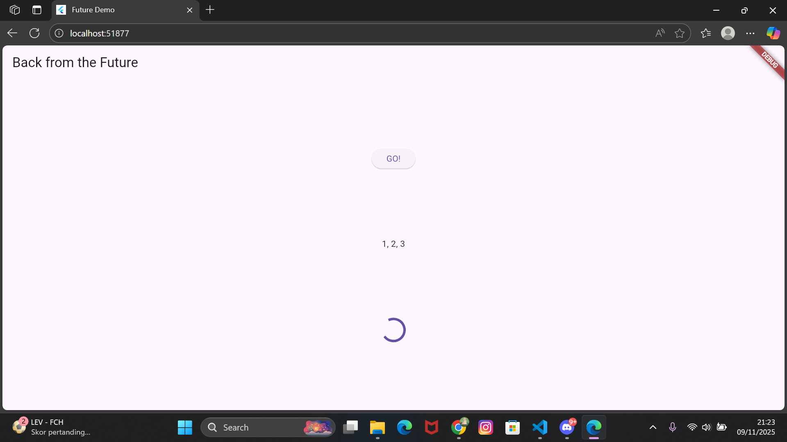
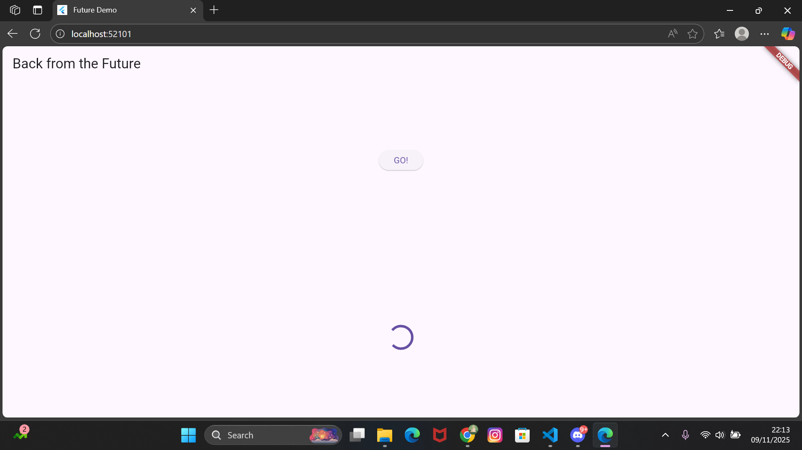
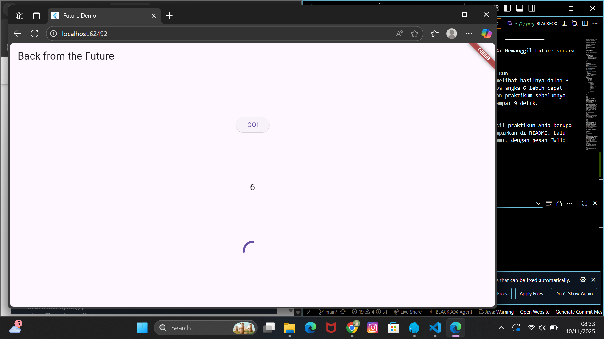
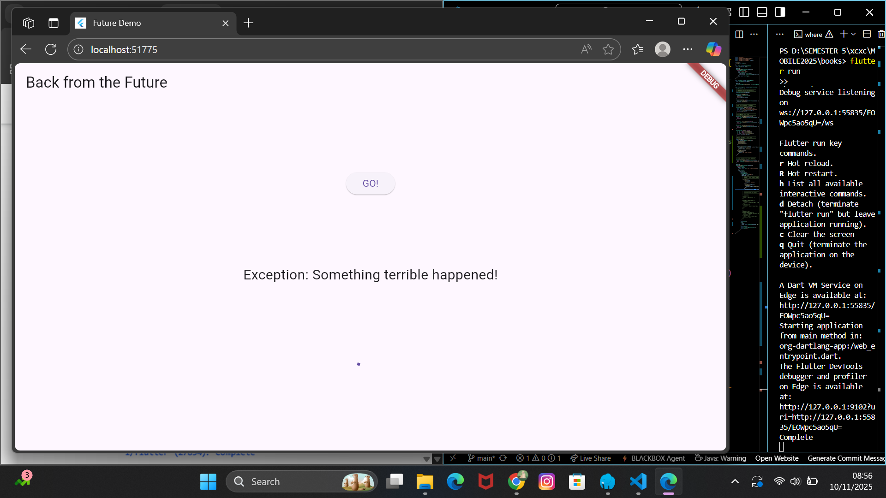
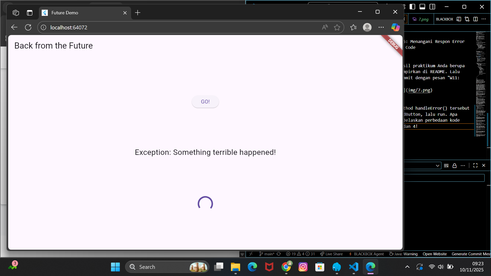
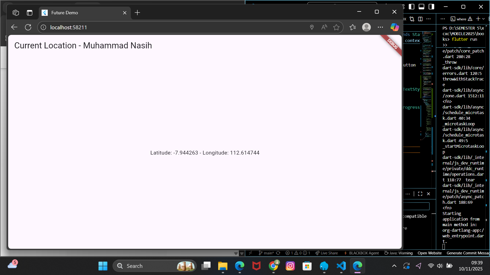
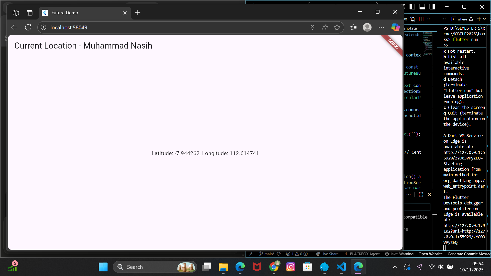
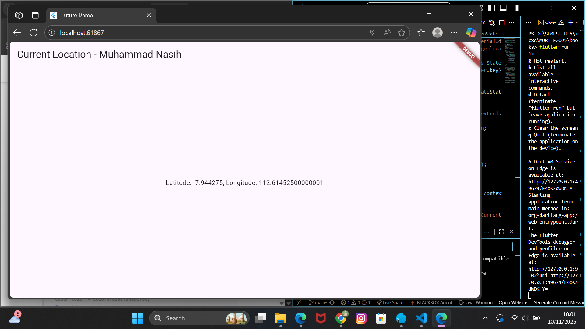

Praktikum 1: Mengunduh Data dari Web Service (API)
Langkah 1: Buat Project Baru
"flutter pub add http"

Langkah 2: Cek file pubspec.yaml
img/1.png

Langkah 3: Buka file main.dart
Langkah 4: Tambah method getData()
import 'dart:async';
import 'package:flutter/material.dart';
import 'package:http/http.dart';
import 'package:http/http.dart' as http;

void main() {
  runApp(const MyApp());
}

class MyApp extends StatelessWidget {
  const MyApp({super.key});

  @override
  Widget build(BuildContext context) {
    return MaterialApp(
      title: 'Future Demo',
      theme: ThemeData(
        primarySwatch: Colors.blue,
        visualDensity: VisualDensity.adaptivePlatformDensity,
      ),
      home: const FuturePage(),
    );
  }
}

class FuturePage extends StatefulWidget {
  const FuturePage({super.key});

  @override
  State<FuturePage> createState() => _FuturePageState();
}

class _FuturePageState extends State<FuturePage> {
  String result = '';
  
  Future<Response> getData() async {
    const authority = 'www.googleapis.com';
    const path = '/books/v1/volumes/junbDwAAQBAJ';
    Uri url = Uri.https(authority, path);
    return http.get(url);
  }
  
  @override
  Widget build(BuildContext context) {
    return Scaffold(
      appBar: AppBar(
        title: const Text('Back from the Future'),
      ),
      body: Center(
        child: Column(
          children: [
            const Spacer(),
            ElevatedButton(
              child: const Text('GO!'),
              onPressed: () {},
            ),
            const Spacer(),
            Text(result),
            const Spacer(),
            const CircularProgressIndicator(),
            const Spacer(),
          ],
        ),
      ),
    );
  }
}

Soal 2

Soal 3
Jelaskan maksud kode langkah 5 tersebut terkait substring dan catchError!
Capture hasil praktikum Anda berupa GIF dan lampirkan di README. Lalu lakukan commit dengan pesan "W11: Soal 3".

Pada langkah 5, kode substring(0, 450) digunakan untuk mengambil hanya 450 karakter pertama dari data response API agar tampilan output tidak terlalu panjang. Sementara itu, catchError berfungsi menangani kesalahan yang terjadi saat proses pemanggilan API, misalnya koneksi internet terputus atau server tidak merespon, sehingga aplikasi tidak error dan tetap menampilkan pesan “An error occurred”.

Praktikum 2: Menggunakan await/async untuk menghindari callbacks
Soal 4
Jelaskan maksud kode langkah 1 dan 2 tersebut!
Capture hasil praktikum Anda berupa GIF dan lampirkan di README. Lalu lakukan commit dengan pesan "W11: Soal 4".

Praktikum 3: Menggunakan Completer di Future
Soal 5
Jelaskan maksud kode langkah 2 tersebut!
Capture hasil praktikum Anda berupa GIF dan lampirkan di README. Lalu lakukan commit dengan pesan "W11: Soal 5".
Pada langkah ini, kita menambahkan sebuah variabel dan dua method ke dalam class _FuturePageState untuk mengelola proses asynchronous secara manual menggunakan Completer.

Langkah 6: Pindah ke onPressed()
Ganti menjadi kode seperti berikut.

getNumber().then((value) {
  setState(() {
    result = value.toString();
  });
}).catchError((e) {
  result = 'An error occurred';
});
Soal 6
Jelaskan maksud perbedaan kode langkah 2 dengan langkah 5-6 tersebut!
Capture hasil praktikum Anda berupa GIF dan lampirkan di README. Lalu lakukan commit dengan pesan "W11: Soal 6".

Praktikum 4: Memanggil Future secara paralel

Langkah 3: Run
Anda akan melihat hasilnya dalam 3 detik berupa angka 6 lebih cepat dibandingkan praktikum sebelumnya menunggu sampai 9 detik.

Soal 7
Capture hasil praktikum Anda berupa GIF dan lampirkan di README. Lalu lakukan commit dengan pesan "W11: Soal 7".

Soal 8
Jelaskan maksud perbedaan kode langkah 1 dan 4!
Langkah 1 cocok untuk async sederhana yang selesai sendiri.

Langkah 4 cocok ketika kita ingin mengontrol kapan Future selesai, misalnya menunggu beberapa operasi, callback, atau event sebelum memberi nilai ke Future.

Praktikum 5: Menangani Respon Error pada Async Code

Soal 9
Capture hasil praktikum Anda berupa GIF dan lampirkan di README. Lalu lakukan commit dengan pesan "W11: Soal 9".

Soal 10
Panggil method handleError() tersebut di ElevatedButton, lalu run. Apa hasilnya? Jelaskan perbedaan kode langkah 1 dan 4!
Langkah 1 hanya bertugas menghasilkan error (producer), sedangkan Langkah 4 bertugas menangani error tersebut dengan aman dan mengupdate UI (consumer). Kombinasi keduanya mendemonstrasikan pattern error handling yang baik dalam Flutter: pisahkan logika yang bisa error dengan mekanisme penanganan errornya.

 6: Menggunakan Future dengan StatefulWidget
 
 Soal 12
Jika Anda tidak melihat animasi loading tampil, kemungkinan itu berjalan sangat cepat. Tambahkan delay pada method getPosition() dengan kode await Future.delayed(const Duration(seconds: 3));
Kode await Future.delayed(const Duration(seconds: 3)); telah ditambahkan pada method getPosition(). Sekarang animasi loading akan terlihat jelas selama 3 detik sebelum koordinat GPS ditampilkan.

Apakah Anda mendapatkan koordinat GPS ketika run di browser? Mengapa demikian?
Ya, bisa mendapatkan koordinat GPS ketika run di browser,
Capture hasil praktikum Anda berupa GIF dan lampirkan di README. Lalu lakukan commit dengan pesan "W11: Soal 12".

7: Manajemen Future dengan FutureBuilder
Soal 13
Apakah ada perbedaan UI dengan praktikum sebelumnya? Mengapa demikian?
Praktikum Sebelumnya (tanpa FutureBuilder):

Menampilkan koordinat dalam format yang sudah diformat:

  Latitude: -7.123456 - Longitude: 112.123456

Menggunakan .then() untuk memformat string secara manual
UI menampilkan teks yang sudah di-customize

Praktikum Sekarang (dengan FutureBuilder):

Menampilkan data Position dalam format raw/default:

  Latitude: -7.123456, Longitude: 112.123456

Menggunakan snapshot.data.toString() yang memanggil method toString() dari objek Position
Output bergantung pada implementasi toString() dari class Position di package geolocator

Capture hasil praktikum Anda berupa GIF dan lampirkan di README. Lalu lakukan commit dengan pesan "W11: Soal 13".

Seperti yang Anda lihat, menggunakan FutureBuilder lebih efisien, clean, dan reactive dengan Future bersama UI.
✅ Lebih efisien - tidak perlu setState() manual
✅ Lebih clean - kode lebih terstruktur dan mudah dibaca
✅ Lebih reactive - otomatis rebuild UI saat Future selesai
✅ Handle state lebih baik - mudah menangani loading, success, dan error state
✅ Declarative approach - sesuai dengan philosophy Flutter

Soal 14
Apakah ada perbedaan UI dengan langkah sebelumnya? Mengapa demikian?
ika Future gagal (misal: izin lokasi ditolak, GPS dimatikan), snapshot.hasError menjadi true.
Namun, kode hanya mengecek connectionState, tidak mengecek hasError.
Akibatnya, masuk ke blok else → menampilkan teks kosong.
Sekarang, saat connectionState == done, kita cek dulu hasError.
Jika ada error → tampilkan pesan error.
Jika tidak → tampilkan data posisi.

Capture hasil praktikum Anda berupa GIF dan lampirkan di README. Lalu lakukan commit dengan pesan "W11: Soal 14".

Soal 15
Tambahkan nama panggilan Anda pada tiap properti title sebagai identitas pekerjaan Anda.
Silakan ganti dengan warna tema favorit Anda.
