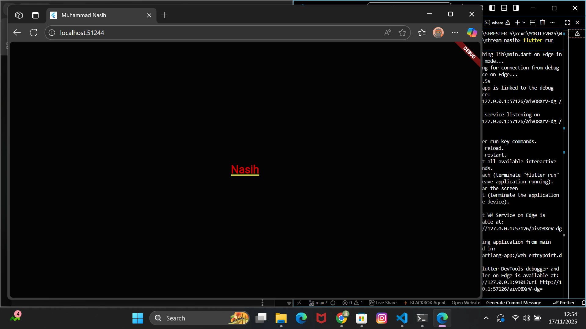
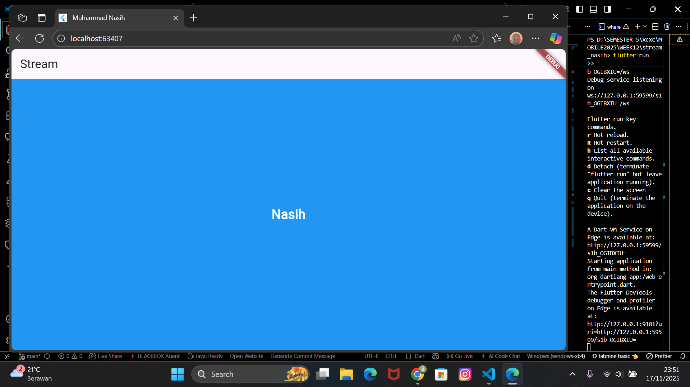
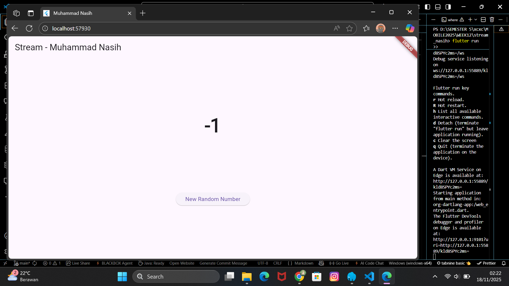
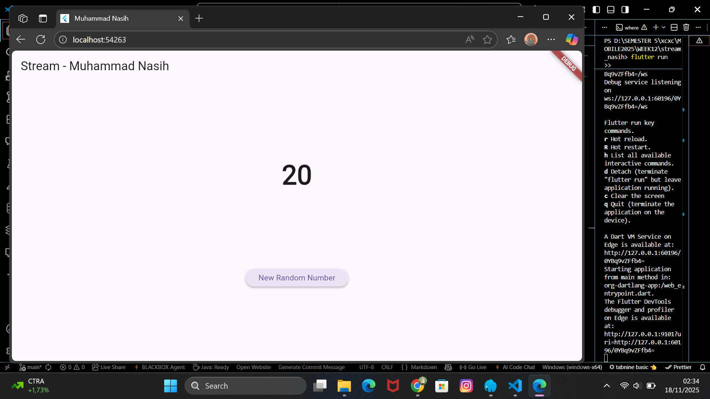
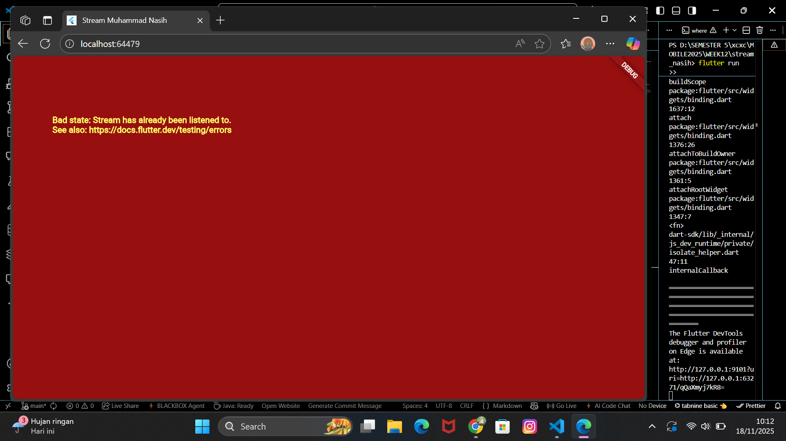
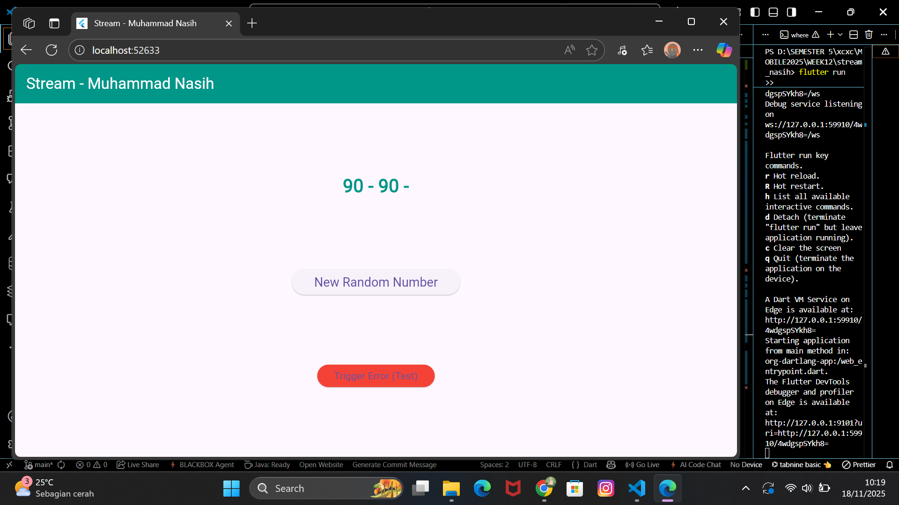

Soal 1
Tambahkan nama panggilan Anda pada title app sebagai identitas hasil pekerjaan Anda.
Gantilah warna tema aplikasi sesuai kesukaan Anda.
Lakukan commit hasil jawaban Soal 1 dengan pesan "W12: Jawaban Soal 1"

Soal 2
Tambahkan 5 warna lainnya sesuai keinginan Anda pada variabel colors tersebut.
Lakukan commit hasil jawaban Soal 2 dengan pesan "W12: Jawaban Soal 2"

Soal 3
Jelaskan fungsi keyword yield* pada kode tersebut!
yield* digunakan untuk mengalirkan (men-forward) seluruh isi dari stream lain ke dalam stream yang sedang dibuat.
Apa maksud isi perintah kode tersebut?
Stream ini mengeluarkan warna yang berbeda setiap 1 detik, secara berulang tanpa henti.
Lakukan commit hasil jawaban Soal 3 dengan pesan "W12: Jawaban Soal 3"

Soal 4
Capture hasil praktikum Anda berupa GIF dan lampirkan di README.
Lakukan commit hasil jawaban Soal 4 dengan pesan "W12: Jawaban Soal 4"

.png)
Soal 5
Jelaskan perbedaan menggunakan listen dan await for (langkah 9) !
Lakukan commit hasil jawaban Soal 5 dengan pesan "W12: Jawaban Soal 5"
listen() → lebih cocok untuk Flutter UI (karena event terus berjalan).

await for → cocok untuk proses berurutan dan blocking.

Soal 6
Jelaskan maksud kode langkah 8 dan 10 tersebut!
Langkah 8 = Menyiapkan "pendengar" yang siap menerima data
Langkah 10 = Mengirim data ke stream saat tombol diklik

Capture hasil praktikum Anda berupa GIF dan lampirkan di README.
Lalu lakukan commit dengan pesan "W12: Jawaban Soal 6".

Soal 7
Jelaskan maksud kode langkah 13 sampai 15 tersebut!
Kembalikan kode seperti semula pada Langkah 15, comment addError() agar Anda dapat melanjutkan ke praktikum 3 berikutnya.
Lalu lakukan commit dengan pesan "W12: Jawaban Soal 7".

Soal 8
Jelaskan maksud kode langkah 1-3 tersebut!
1      late StreamController<int> _streamController;	Membuat controller untuk mengelola aliran data bertipe int. Digunakan untuk mengirim data ke stream.
2	transformer = StreamTransformer<int, int>.fromHandlers(...)	Membuat transformer yang memproses data sebelum diteruskan ke listener. Di sini, data dikalikan 10 dan jika terjadi error, nilai -1 dikirim.
3	stream.transform(transformer).listen(...)	Mendengarkan stream yang sudah ditransformasi. Hasilnya ditampilkan di UI, dan jika terjadi error, teks akan berubah menjadi -1.
Capture hasil praktikum Anda berupa GIF dan lampirkan di README.
Lalu lakukan commit dengan pesan "W12: Jawaban Soal 8".

Soal 10

Jelaskan mengapa error itu bisa terjadi ?
error itu memang sengaja dibuat agar kita belajar cara menanganinya dengan baik menggunakan StreamTransformer dan StreamSubscription.
Soal 11
Jelaskan mengapa hal itu bisa terjadi ?
Error terjadi karena secara default StreamController membuat single-subscription stream yang hanya boleh memiliki satu listener. Ketika kita menambahkan dua subscription (subscription & subscription2), Dart melarangnya dan melempar exception. Error tersebut hilang setelah kita mengubah stream menjadi broadcast stream menggunakan .asBroadcastStream(), sehingga stream dapat didengarkan oleh banyak listener secara bersamaan.
Capture hasil praktikum Anda berupa GIF dan lampirkan di README.

Lalu lakukan commit dengan pesan "W12: Jawaban Soal 10,11".