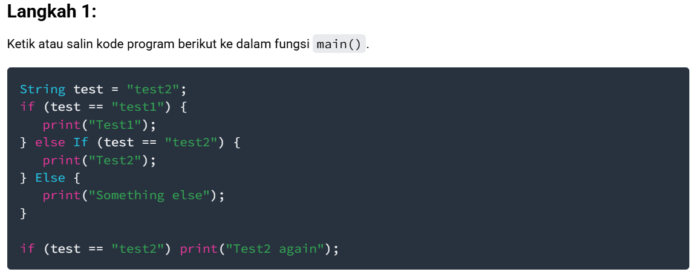

Praktikum 1: Menerapkan Control Flows ("if/else")

Langkah 2:

Silakan coba eksekusi (Run) kode pada langkah 1 tersebut. Apa yang terjadi? Jelaskan!
Program menampilkan dua baris output:

Jawaban : 
Test2 → hasil dari else if

Test2 again → hasil dari if kedua

Langkah 3:

Tambahkan kode program berikut, lalu coba eksekusi (Run) kode Anda.

String test = "true";
if (test) {
   print("Kebenaran");
}
Apa yang terjadi ? Jika terjadi error, silakan perbaiki namun tetap menggunakan if/else.

Jawaban : Karena di Dart, ekspresi di dalam if (...) harus bertipe bool, sedangkan test adalah String.

2: Menerapkan Perulangan "while" dan "do-while"
Langkah 1:
Ketik atau salin kode program berikut ke dalam fungsi main().

while (counter < 33) {
  print(counter);
  counter++;
}
Langkah 2:
Silakan coba eksekusi (Run) kode pada langkah 1 tersebut. Apa yang terjadi? Jelaskan! Lalu perbaiki jika terjadi error.

Jawaban : Hasilnya kalau dijalankan → error: Error: Undefined name 'counter'.

Langkah 3:
Tambahkan kode program berikut, lalu coba eksekusi (Run) kode Anda.

do {
  print(counter);
  counter++;
} while (counter < 77);
Apa yang terjadi ? Jika terjadi error, silakan perbaiki namun tetap menggunakan do-while.

Praktikum 3: Menerapkan Perulangan "for" dan "break-continue"
Langkah 1:
Ketik atau salin kode program berikut ke dalam fungsi main().

for (Index = 10; index < 27; index) {
  print(Index);
}
Langkah 2:
Silakan coba eksekusi (Run) kode pada langkah 1 tersebut. Apa yang terjadi? Jelaskan! Lalu perbaiki jika terjadi error.

Jawaban : index tidak dideklarasikan sebelumnya.

Langkah 3:
Tambahkan kode program berikut di dalam for-loop, lalu coba eksekusi (Run) kode Anda.

If (Index == 21) break;
Else If (index > 1 || index < 7) continue;
print(index);
Apa yang terjadi ? Jika terjadi error, silakan perbaiki namun tetap menggunakan for dan break-continue.

Jawaban : If dan Else If di Dart harus huruf kecil → if, else if.

Tugas Praktikum
1. Silakan selesaikan Praktikum 1 sampai 3, lalu dokumentasikan berupa screenshot hasil pekerjaan beserta penjelasannya!

2. Buatlah sebuah program yang dapat menampilkan bilangan prima dari angka 0 sampai 201 menggunakan Dart. Ketika bilangan prima ditemukan, maka tampilkan nama lengkap dan NIM Anda.

Kumpulkan berupa link commit repo GitHub kepada dosen pengampu sesuai kesepakatan di kelas!