NAMA : Muhammad Nasih
KELAS : TI 3H
NIM : 2341720009

Praktikum 1: Eksperimen Tipe Data List
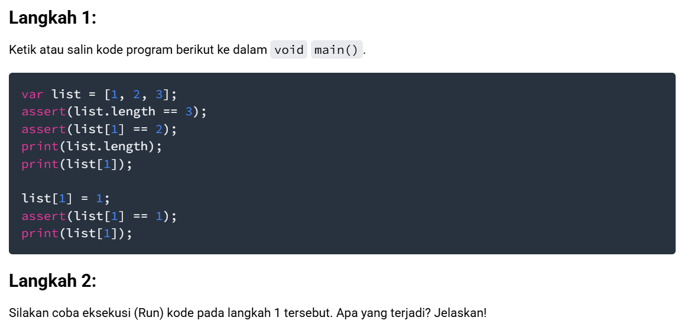
program menunjukkan bahwa elemen list bisa diakses dan diubah nilainya melalui indeks.

Langkah 3:
Ubah kode pada langkah 1 menjadi variabel final yang mempunyai index = 5 dengan default value = null. Isilah nama dan NIM Anda pada elemen index ke-1 dan ke-2. Lalu print dan capture hasilnya.

Apa yang terjadi ? Jika terjadi error, silakan perbaiki. 
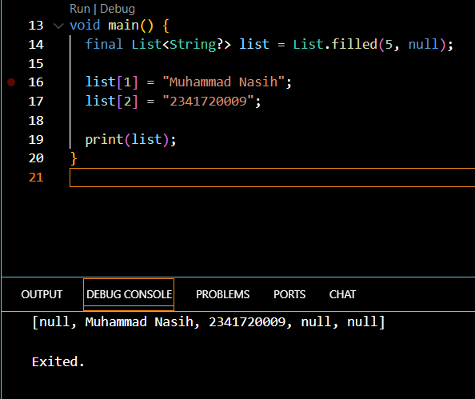
Tidak akan error selama hanya mengubah isi elemen, bukan mengganti keseluruhan list.

Praktikum 2: Eksperimen Tipe Data Set
Langkah 1:
Ketik atau salin kode program berikut ke dalam fungsi main().

var halogens = {'fluorine', 'chlorine', 'bromine', 'iodine', 'astatine'};
print(halogens);

Langkah 2:
Silakan coba eksekusi (Run) kode pada langkah 1 tersebut. Apa yang terjadi? Jelaskan! Lalu perbaiki jika terjadi error
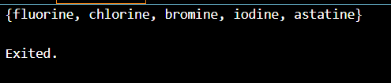
tidak perlu perbaikan.

Langkah 3:
Tambahkan kode program berikut, lalu coba eksekusi (Run) kode Anda.

var names1 = <String>{};
Set<String> names2 = {}; // This works, too.
var names3 = {}; // Creates a map, not a set.

print(names1);
print(names2);
print(names3);

Apa yang terjadi ? Jika terjadi error, silakan perbaiki namun tetap menggunakan ketiga variabel tersebut. Tambahkan elemen nama dan NIM Anda pada kedua variabel Set tersebut dengan dua fungsi berbeda yaitu .add() dan .addAll(). Untuk variabel Map dihapus, nanti kita coba di praktikum selanjutnya.
kode yang diminta 
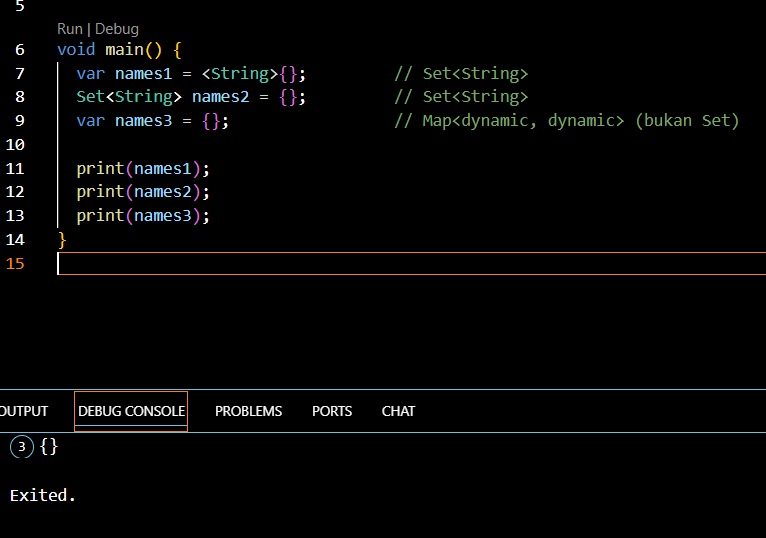
kode perbaikan
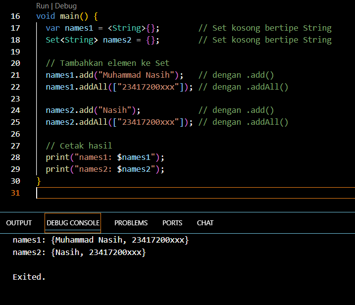
names1 dan names2 berhasil menyimpan nama & NIM.
names3 dihapus sementara, karena default {} di Dart berarti Map, bukan Set.

Praktikum 3: Eksperimen Tipe Data Maps
Langkah 1:
Ketik atau salin kode program berikut ke dalam fungsi main().

var gifts = {
  // Key:    Value
  'first': 'partridge',
  'second': 'turtledoves',
  'fifth': 1
};

var nobleGases = {
  2: 'helium',
  10: 'neon',
  18: 2,
};

print(gifts);
print(nobleGases);

Langkah 2:
Silakan coba eksekusi (Run) kode pada langkah 1 tersebut. Apa yang terjadi? Jelaskan! Lalu perbaiki jika terjadi error.
Hasil Output nya :
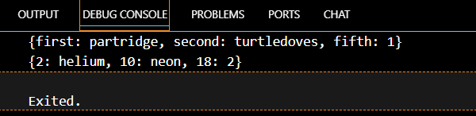

Langkah 3:
Tambahkan kode program berikut, lalu coba eksekusi (Run) kode Anda.

var mhs1 = Map<String, String>();
gifts['first'] = 'partridge';
gifts['second'] = 'turtledoves';
gifts['fifth'] = 'golden rings';

var mhs2 = Map<int, String>();
nobleGases[2] = 'helium';
nobleGases[10] = 'neon';
nobleGases[18] = 'argon';
Apa yang terjadi ? Jika terjadi error, silakan perbaiki.

Tambahkan elemen nama dan NIM Anda pada tiap variabel di atas (gifts, nobleGases, mhs1, dan mhs2).

Kode yang di minta 
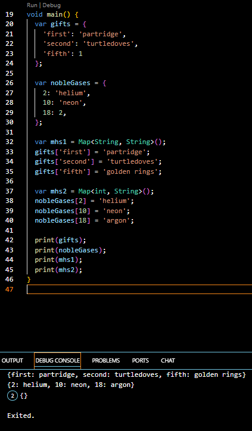

Kode + taambahkan NIM
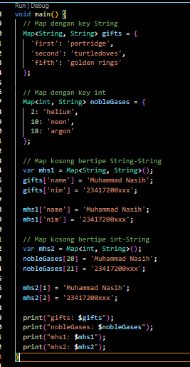
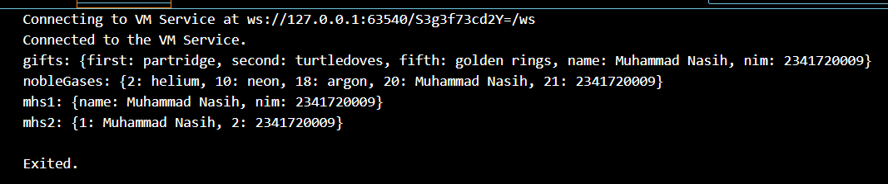

Praktikum 4: Eksperimen Tipe Data List: Spread dan Control-flow Operators
Selesaikan langkah-langkah praktikum berikut ini menggunakan VS Code atau Code Editor favorit Anda.

Langkah 1:
Ketik atau salin kode program berikut ke dalam fungsi main().

var list = [1, 2, 3];
var list2 = [0, ...list];
print(list1);
print(list2);
print(list2.length);
Langkah 2:
Silakan coba eksekusi (Run) kode pada langkah 1 tersebut. Apa yang terjadi? Jelaskan! Lalu perbaiki jika terjadi error.
 Hasil eror :
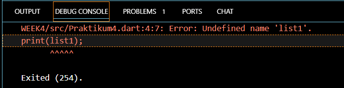
perbaikan :
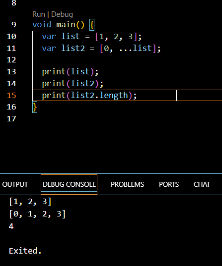
perbaikannya cukup ganti print(list1); menjadi print(list);.

Langkah 3:
Tambahkan kode program berikut, lalu coba eksekusi (Run) kode Anda.

list1 = [1, 2, null];
print(list1);
var list3 = [0, ...?list1];
print(list3.length);
Apa yang terjadi ? Jika terjadi error, silakan perbaiki.
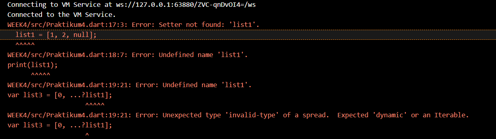
Tambahkan variabel list berisi NIM Anda menggunakan Spread Operators.
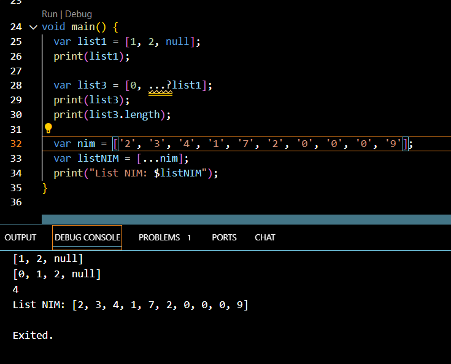

Langkah 4:
Tambahkan kode program berikut, lalu coba eksekusi (Run) kode Anda.

var nav = ['Home', 'Furniture', 'Plants', if (promoActive) 'Outlet'];
print(nav);
Apa yang terjadi ? Jika terjadi error, silakan perbaiki. Tunjukkan hasilnya jika variabel promoActive ketika true dan false.
Error: Undefined name 'promoActive'.
Karena variabel promoActive belum pernah didefinisikan.

kode perbaikan :
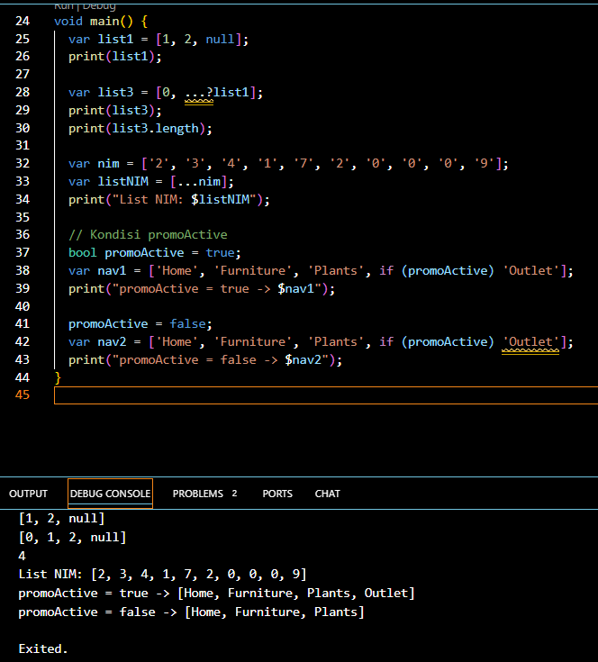

Langkah 5:
Tambahkan kode program berikut, lalu coba eksekusi (Run) kode Anda.

var nav2 = ['Home', 'Furniture', 'Plants', if (login case 'Manager') 'Inventory'];
print(nav2);
Apa yang terjadi ? Jika terjadi error, silakan perbaiki. Tunjukkan hasilnya jika variabel login mempunyai kondisi lain.
Error: Undefined name 'login'.
dan juga karena sintaks if (login case 'Manager') tidak valid di Dart.
Kode perbaikan :
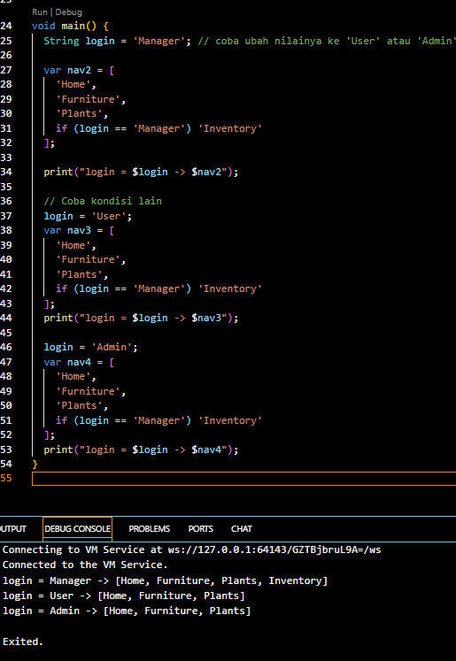

Langkah 6:
Tambahkan kode program berikut, lalu coba eksekusi (Run) kode Anda.

var listOfInts = [1, 2, 3];
var listOfStrings = ['#0', for (var i in listOfInts) '#$i'];
assert(listOfStrings[1] == '#1');
print(listOfStrings);
Apa yang terjadi ? Jika terjadi error, silakan perbaiki. Jelaskan manfaat Collection For dan dokumentasikan hasilnya.
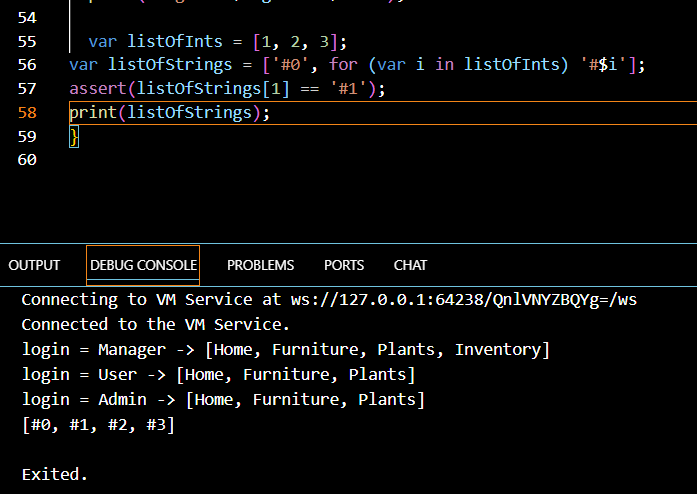
Collection For memudahkan kita untuk membuat list/collection baru dari data lain secara langsung di dalam literal.

Praktikum 5: Eksperimen Tipe Data Records
Langkah 1:
Ketik atau salin kode program berikut ke dalam fungsi main().

var record = ('first', a: 2, b: true, 'last');
print(record)
Langkah 2:
Silakan coba eksekusi (Run) kode pada langkah 1 tersebut. Apa yang terjadi? Jelaskan! Lalu perbaiki jika terjadi error.
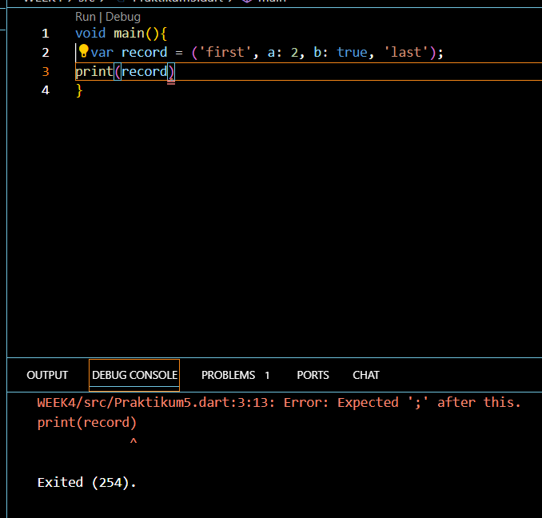
Perbaikan : 
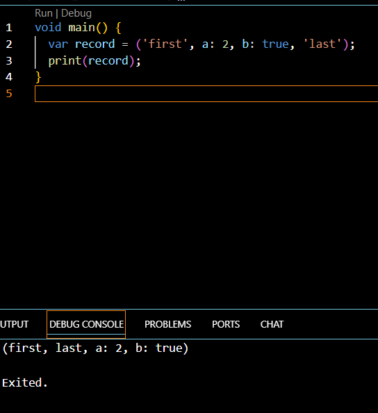

Langkah 3:
Tambahkan kode program berikut di luar scope void main(), lalu coba eksekusi (Run) kode Anda.

(int, int) tukar((int, int) record) {
  var (a, b) = record;
  return (b, a);
}
Apa yang terjadi ? Jika terjadi error, silakan perbaiki. Gunakan fungsi tukar() di dalam main() sehingga tampak jelas proses pertukaran value field di dalam Records.

Error terjadi karena tipe record di main() tidak sesuai dengan parameter fungsi tukar.

Setelah diperbaiki dengan record (int, int), program berjalan normal.

Fungsi tukar memperlihatkan jelas bagaimana nilai field di dalam Records bisa ditukar urutannya.
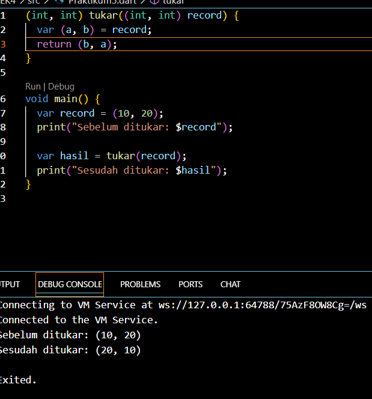

Langkah 4:
Tambahkan kode program berikut di dalam scope void main(), lalu coba eksekusi (Run) kode Anda.

// Record type annotation in a variable declaration:
(String, int) mahasiswa;
print(mahasiswa);
Apa yang terjadi ? Jika terjadi error, silakan perbaiki. Inisialisasi field nama dan NIM Anda pada variabel record mahasiswa di atas. Dokumentasikan hasilnya dan buat laporannya!
Akan muncul Error: Non-nullable variable 'mahasiswa' must be assigned before it can be used.
Kode Perbaikan : 
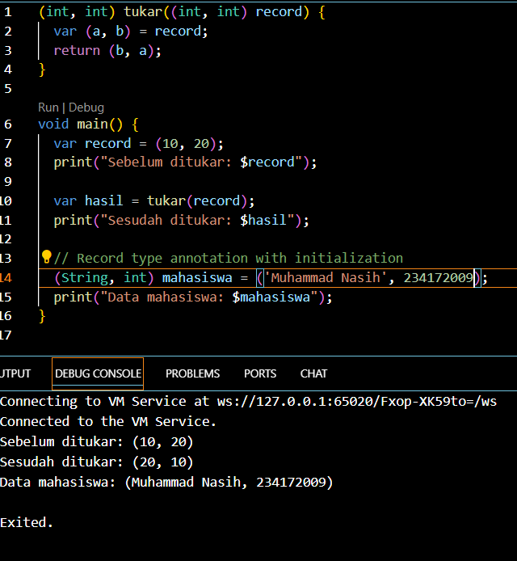

Langkah 5:
Tambahkan kode program berikut di dalam scope void main(), lalu coba eksekusi (Run) kode Anda.

var mahasiswa2 = ('first', a: 2, b: true, 'last');

print(mahasiswa2.$1); // Prints 'first'
print(mahasiswa2.a); // Prints 2
print(mahasiswa2.b); // Prints true
print(mahasiswa2.$2); // Prints 'last'
Apa yang terjadi ? Jika terjadi error, silakan perbaiki. Gantilah salah satu isi record dengan nama dan NIM Anda, lalu dokumentasikan hasilnya dan buat laporannya!
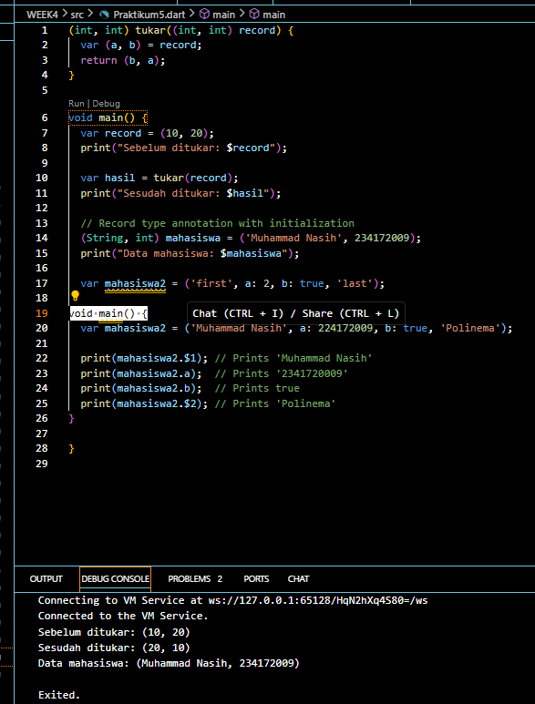

7. Tugas Praktikum
1. Silakan selesaikan Praktikum 1 sampai 5, lalu dokumentasikan berupa screenshot hasil pekerjaan Anda beserta penjelasannya!
Jawaban : sudah
2. Jelaskan yang dimaksud Functions dalam bahasa Dart!
Jawaban : Function di Dart adalah blok kode yang dapat dipanggil kembali untuk menjalankan tugas tertentu. Function bisa punya parameter untuk input dan return value untuk output.
3. Jelaskan jenis-jenis parameter di Functions beserta contoh sintaksnya!
Jawaban : Dalam Dart, ada beberapa jenis parameter pada function. Positional parameter adalah parameter yang urutannya harus sesuai ketika dipanggil, misalnya:

void greet(String name, int age) {
  print("Hello $name, umurmu $age tahun");
}
greet("Nasih", 20);

Kemudian ada optional positional parameter yang ditulis dengan tanda [], parameter ini boleh diisi atau tidak:

void greet(String name, [String? hobby]) {
  print("Hello $name, hobi: ${hobby ?? "tidak ada"}");
}
greet("Nasih");
greet("Nasih", "Futsal");

Berikutnya, named parameter ditulis dengan {} dan dipanggil berdasarkan nama, bisa diberi required atau nilai default:

void register({required String name, int age = 18}) {
  print("Nama: $name, Umur: $age");
}
register(name: "Nasih");
register(name: "Nasih", age: 20);

Terakhir, ada mixing yaitu gabungan positional dan named parameter:

void orderFood(String menu, {int qty = 1, bool spicy = false}) {
  print("Pesan $qty $menu, pedas: $spicy");
}
orderFood("Nasi Goreng");
orderFood("Mie Ayam", qty: 2, spicy: true);

4. Jelaskan maksud Functions sebagai first-class objects beserta contoh sintaknya!
Jawaban : Dalam Dart, function adalah first-class objects, artinya function bisa diperlakukan seperti data biasa: disimpan dalam variabel, dikirim sebagai parameter, atau dikembalikan dari function lain.

Contoh sederhana:

// Simpan function di variabel
var sayHello = (String name) {
  print("Hello $name");
};
sayHello("Nasih");

// Function sebagai parameter
void run(Function action) {
  action();
}
run(() => print("Jalanin fungsi dari parameter"));

// Function sebagai return value
Function kali(int faktor) {
  return (int x) => x * faktor;
}
var duaKali = kali(2);
print(duaKali(5)); // output: 10

5. Apa itu Anonymous Functions? Jelaskan dan berikan contohnya!
Jawaban : Anonymous Function adalah fungsi tanpa nama. Dipakai kalau kita butuh fungsi cepat/sekali pakai.

Contoh:

// Disimpan di variabel
var sayHello = (String name) {
  print("Hello $name");
};
sayHello("Nasih");

// Dipakai langsung sebagai parameter
void jalankan(Function fn) {
  fn();
}
jalankan(() {
  print("Halo dari anonymous function");
});

// Versi singkat (arrow function)
var square = (int x) => x * x;
print(square(5)); // 25

6. Jelaskan perbedaan Lexical scope dan Lexical closures! Berikan contohnya!
Jawaban : Lexical Scope

Artinya fungsi bisa mengakses variabel luar sesuai posisi kode ditulis.

void main() {
  var name = "Nasih";

  void sayHello() {
    print("Hello $name"); // bisa pakai 'name'
  }

  sayHello(); // Hello Nasih
}

Lexical Closure

Fungsi bisa menyimpan dan mengingat variabel luar, meski fungsi luar sudah selesai.

Function counter() {
  int count = 0;

  return () {
    count++;
    return count;
  };
}

void main() {
  var tambah = counter();
  print(tambah()); // 1
  print(tambah()); // 2
  print(tambah()); // 3
}

7. Jelaskan dengan contoh cara membuat return multiple value di Functions!
Jawaban : Di Dart, function cuma bisa return satu nilai, tapi kita bisa bungkus beberapa data jadi satu:

1. Pakai List
List<int> getNumbers() {
  return [10, 20];
}

void main() {
  var nums = getNumbers();
  print(nums[0]); // 10
  print(nums[1]); // 20
}

2. Pakai Map
Map<String, dynamic> getUser() {
  return {"name": "Nasih", "age": 20};
}

void main() {
  var user = getUser();
  print(user["name"]); // Nasih
  print(user["age"]);  // 20
}

3. Pakai Class
class User {
  String name;
  int age;
  User(this.name, this.age);
}

User getUser() {
  return User("Nasih", 20);
}

void main() {
  var u = getUser();
  print(u.name); // Nasih
  print(u.age);  // 20
}