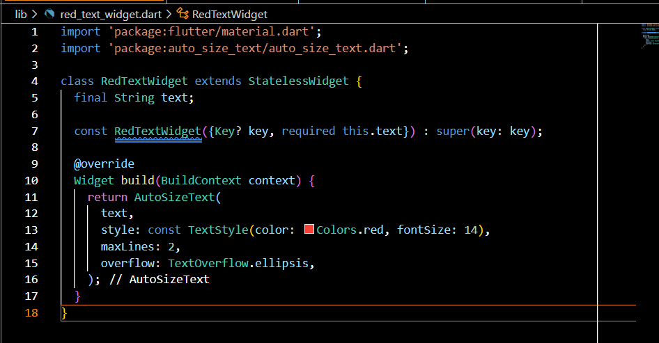

Praktikum Menerapkan Plugin di Project Flutter
Langkah 1: Buat Project Baru

Langkah 2: Menambahkan Plugin
Praktikum ini mendemonstrasikan penggunaan plugin `auto_size_text` di Flutter untuk membuat teks yang secara otomatis menyesuaikan ukurannya agar muat dalam container.

Kesimpulan:
Plugin `auto_size_text` sangat berguna untuk membuat UI yang responsif dan mencegah masalah overflow text pada berbagai ukuran layar.
Langkah 3: Buat file red_text_widget.dart

Langkah 4: Tambah Widget AutoSizeText
Masih di file red_text_widget.dart, untuk menggunakan plugin auto_size_text, ubahlah kode return Container() menjadi seperti berikut.

return AutoSizeText(
      text,
      style: const TextStyle(color: Colors.red, fontSize: 14),
      maxLines: 2,
      overflow: TextOverflow.ellipsis,
);
Setelah Anda menambahkan kode di atas, Anda akan mendapatkan info error. Mengapa demikian? Jelaskan dalam laporan praktikum Anda!
Flutter tidak mengenali AutoSizeText sebagai widget bawaan, karena widget ini berasal dari package eksternal bernama auto_size_text.

Langkah 5: Buat Variabel text dan parameter di constructor

Langkah 5 bertujuan untuk membuat widget RedTextWidget yang reusable dan fleksibel dengan menambahkan variabel text bertipe String yang bersifat final (immutable). Constructor widget ini menggunakan named parameter dengan keyword required pada parameter text untuk memastikan bahwa nilai text wajib diisi saat widget dibuat, sehingga mencegah terjadinya error runtime. Penggunaan parameter Key yang bersifat opsional memungkinkan identifikasi widget dalam widget tree yang berguna untuk keperluan testing dan animation. Dengan memanggil super constructor menggunakan initializer list, parameter key diteruskan ke parent class StatelessWidget untuk memastikan hierarchy widget tetap benar. Pendekatan ini mengikuti best practice Flutter dalam pengembangan widget yang modular, type-safe, dan mudah digunakan di berbagai tempat dalam aplikasi, sehingga meningkatkan maintainability dan reusability kode.

Langkah 6: Tambahkan widget di main.dart

Kedua widget Container yang ditambahkan pada langkah 6 memiliki fungsi untuk mendemonstrasikan perbedaan antara penggunaan AutoSizeText dan Text biasa dalam menangani masalah overflow teks. Container pertama dengan background kuning menggunakan RedTextWidget yang di dalamnya terdapat AutoSizeText dengan lebar hanya 50 pixel, sehingga ukuran font akan menyesuaikan secara otomatis agar teks muat dalam ruang yang sangat sempit tersebut tanpa terjadi overflow. Sebaliknya, Container kedua dengan background hijau menggunakan widget Text standar Flutter dengan lebar 100 pixel yang lebih besar, namun karena tidak memiliki kemampuan auto-sizing, teks akan terpotong atau overflow ketika konten terlalu panjang untuk ditampung dalam container tersebut. Perbandingan visual ini membuktikan keunggulan plugin auto_size_text dalam membuat UI yang responsif dan mencegah masalah overflow text, terutama ketika berhadapan dengan berbagai ukuran layar atau container yang dinamis. Dengan melihat kedua contoh secara berdampingan, developer dapat memahami pentingnya menggunakan AutoSizeText untuk menciptakan user interface yang lebih robust dan user-friendly.
HASIL :

TUGAS Praktikum
5.Jelaskan maksud dari tiap parameter yang ada di dalam plugin auto_size_text berdasarkan tautan pada dokumentasi ini !
AutoSizeText adalah widget yang mirip seperti Text, tetapi bisa menyesuaikan ukuran font secara otomatis agar teks tetap muat di dalam ruang yang tersedia tanpa melampaui batas baris (maxLines).