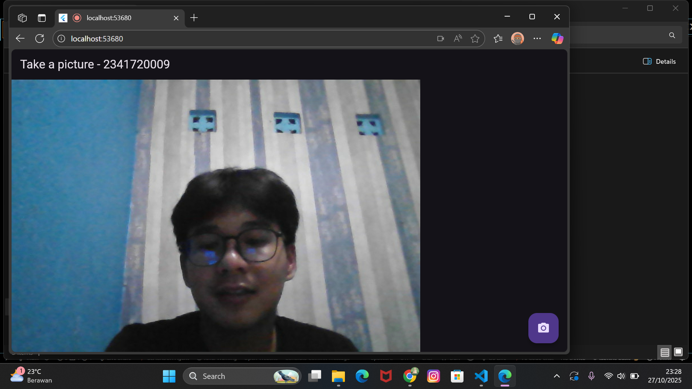
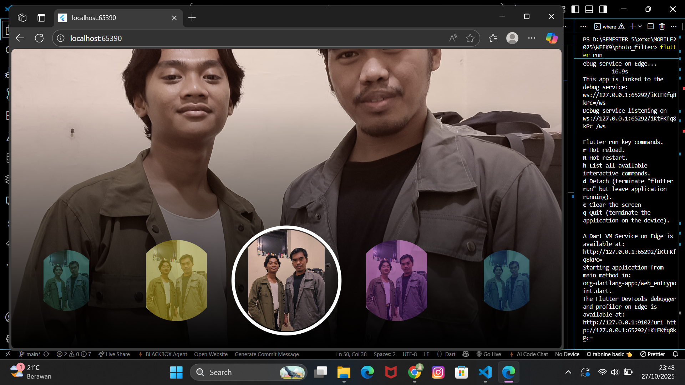

Tugas Praktikum
Selesaikan Praktikum 1 dan 2, lalu dokumentasikan dan push ke repository Anda berupa screenshot setiap hasil pekerjaan beserta penjelasannya di file README.md! Jika terdapat error atau kode yang tidak dapat berjalan, silakan Anda perbaiki sesuai tujuan aplikasi dibuat!
HASIL PRAKTIKUM 1: 

HASIL PRAKTIKUM 2: 

Gabungkan hasil praktikum 1 dengan hasil praktikum 2 sehingga setelah melakukan pengambilan foto, dapat dibuat filter carouselnya!

Jelaskan maksud void async pada praktikum 1?
async digunakan pada sebuah fungsi ketika fungsi tersebut perlu menjalankan proses yang memerlukan waktu atau tidak langsung selesai, seperti membuka kamera, mengambil data dari internet, membaca file, dan sebagainya. Dengan menggunakan async, fungsi tersebut dapat menunggu proses lain menggunakan await tanpa membuat aplikasi menjadi macet atau berhenti.

Jika ditulis void async atau Future<void> async, artinya fungsi tersebut:

Tidak mengembalikan nilai (void), tetapi

Tetap berjalan secara asynchronous (tidak langsung selesai dan dapat menggunakan await).

Jadi, secara sederhana:
async membuat fungsi bisa menjalankan proses yang butuh waktu tanpa menghentikan program, sedangkan void menunjukkan bahwa fungsi tidak mengembalikan nilai.

Jelaskan fungsi dari anotasi @immutable dan @override ?
Anotasi @immutable digunakan untuk menandakan bahwa sebuah kelas tidak boleh diubah setelah dibuat. Artinya, semua properti di dalam kelas tersebut harus bersifat tetap (final) agar datanya tidak berubah. Ini penting untuk menjaga konsistensi widget.

Sedangkan @override digunakan ketika kita menulis ulang method yang sudah ada di kelas induk. Dengan anotasi ini, kita memberi tahu bahwa method tersebut adalah versi yang digantikan dari parent class, seperti build() atau initState(), agar sesuai kebutuhan aplikasi.

Kumpulkan link commit repository GitHub Anda kepada dosen yang telah disepakati!